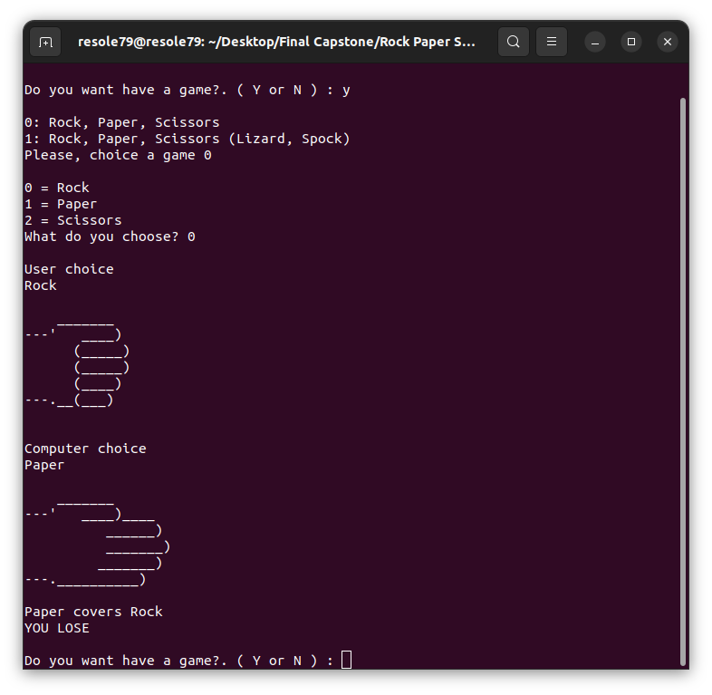
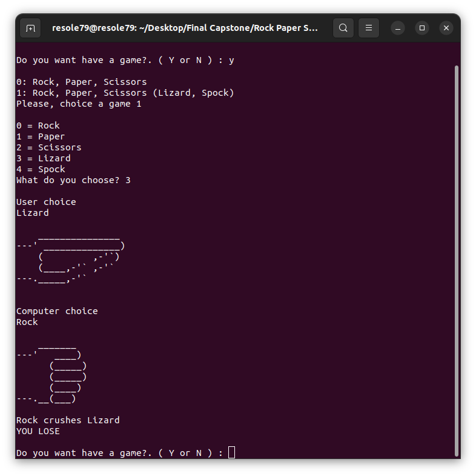

## Rock, Paper, Scissors Game

Program for **Rock, Paper, Scissors** game.    
###### It's a part of the **#100DaysOfCode** challenge by *Angela Yu*. ######   


#### Basic Rules

- Rock smashes Scissors
- Scissors cuts Paper
- Paper covers Rock

Look at this site [wrpsa.com](https://wrpsa.com/)

#### I have extend the game to *Rock, Paper, Scissors (Lizard, Spock)* from "The Big Bang Theory" idea
#### Rock, Paper, Scissors (Lizard, Spock) Rules

- Scissors cuts Paper
- Paper covers Rock
- Rock crushes Lizard
- Lizard poisons Spock
- Spock smashes Scissors
- Scissors decapitates Lizard
- Lizard eats Paper
- Paper disproves Spock
- Spock vaporizes Rock
- Rock smashes Scissors


From S02E08 **"The Big Bang Theory"** by *Chuck Lorre and Bill Prady*   

 


Look at the rules on [youtube.com](https://www.youtube.com/watch?v=o3DbTquqgCY)


#### Prerequisites
You will need the following software to run the "Rock, Paper, Scissors Game":
 - [Python 3](https://www.python.org/downloads/)

#### Installation
To get started with the **"Rock, Paper, Scissors Game"**, follow these steps:

1. **Clone** the repository:

```sh
git clone https://github.com/resole79/rock_paper_scissors_game.git
```

2. **Run** the **rock_paper_scissors_game.py** file:

```sh
python rock_paper_scissors_game.py
```

#### File Structure   
 - **rock_paper_scissors_game.py**: Main program.


#### **Usage**

Ask the user to input:
 - Choice the game
 - Choice the player


**User choice to play at Rock, Paper, Scissors game**




**User choice to play at Rock, Paper, Scissors (Lizard, Spock) game**




## **Credit**

Author : Emilio Reforgiato (resole79)

##
<p align="right"><a href="https://www.linkedin.com/in/emilio-reforgiato/" target=”_blank” ></a></p>


